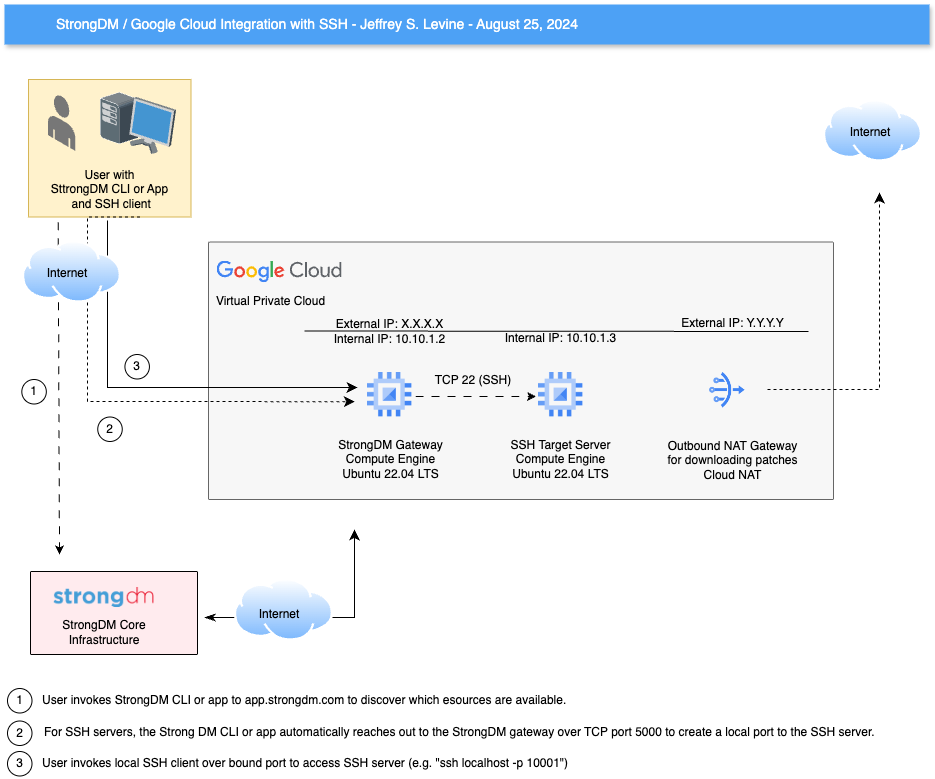

# StrongDM Simple SSH Demo on Google Cloud

## Introduction

The purpose of this repository is to show how to use StrongDM within Google
Cloud to connect to an SSH server.
The infrastructure consists of a Google Cloud VPC with an Ubuntu Linux server serving as the StrongDM gateway and another Ubuntu Linux server that runs SSH.
The StrongDM gateway server has an external IP.
The SSH server only has an internal IP.

## Architecture

## Instructions

To be written!
